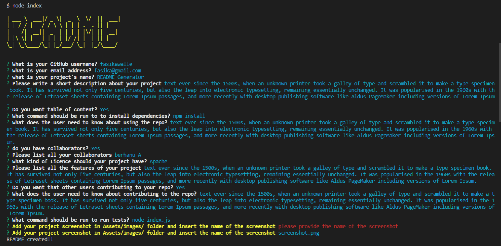

# README Generator

## Description

This command line application is used to create README files by asking a user for inputs information about the project which later display in the README file.This application use inquirer module for the prompt,figlet and colors module for coloring and decorating the text.

## Table of Content

- [Installation](#Installation)
- [Usage](#Usage)
- [Licence](#Licence)
- [Features](#Features)
- [Tests](#Tests)

## Installation

First you have to make sure that you have node js in your system if you don't have you can install it from https://nodejs.org/en/ then open the terminal and type `npm install`

## Usage

- Clone the code from the repository to local computer
- Open the code with text editor and open the terminal
- write npm install in the terminal and hit enter to install all the module dependencies that this application uses
- Type node index.js to run the file
- Enter the neccesary information about your project and finally your README file is generated in utilis folder.
  
  

## Licence

This Licence belongs to Apache

## Features

provide table of content based on your choice

## Tests

`node index.js`

## Questions

If you have any question about the repo, open an issue or contact me directly at [fasikaWalle](https://github.com/fasikaWalle/)

If you want to reach me for further questions please contact me through fasikabini12@gmail.com
